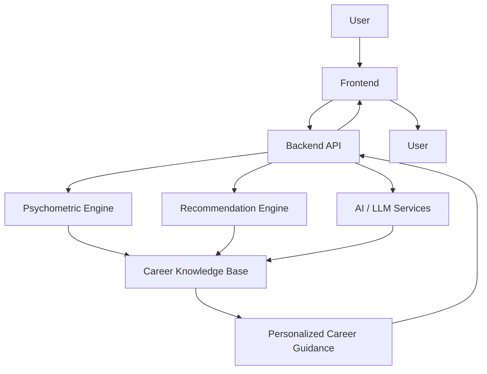
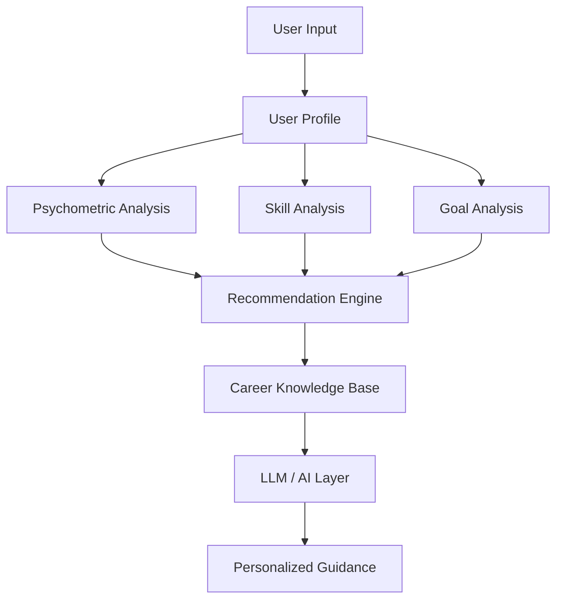

# CounselX

> AI-powered career counselling and recommendation platform for personalized career discovery, skill analysis, and career planning.

Watch CounselX in action:

https://github.com/user-attachments/assets/092bf0b7-1a3c-4d6f-af8e-b0ba4688fda3

CounselX is an AI-powered career counselling platform designed to help **students and professionals discover suitable career paths** based on their interests, skills, personality, education, and goals.

The platform combines **AI, psychometric assessments, machine-learning-based recommendations, and a structured career knowledge base** to provide personalized and actionable career guidance.

## Table of Contents

* [Overview](#overview)
* [Problem Statement](#problem-statement)
* [Proposed Solution](#proposed-solution)
* [Key Features](#key-features)
* [How It Works](#how-it-works)
* [System Architecture](#system-architecture)
* [AI Architecture](#ai-architecture)
* [Technology Stack](#technology-stack)
* [Project Structure](#project-structure)
* [Getting Started](#getting-started)
* [Goals](#goals)
* [Roadmap](#roadmap)
* [Project Targets](#project-targets)
* [Limitations](#limitations)
* [Disclaimer](#disclaimer)
* [Project Status](#project-status)
* [Contributors](#contributors)

---

## Overview

Choosing a career often involves navigating a large number of possibilities across different industries, educational paths, skill requirements, and career trajectories.

CounselX aims to bring these factors together into a single platform where users can assess their interests and personality, understand their existing skills, explore career options, identify skill gaps, and receive personalized career guidance.

The platform is designed for:

* Students exploring career options
* Professionals considering career transitions
* Users seeking personalized career guidance
* Users comparing different career paths
* Users looking to identify skills required for a target career

The core idea is to combine **structured career information with AI-driven interaction and recommendation logic** rather than relying on a generic chatbot alone.

---

## Problem Statement

Career decisions can be difficult because users often need to consider multiple factors simultaneously, including:

* Personal interests
* Personality and preferences
* Existing skills
* Educational background
* Career goals
* Required qualifications
* Industry opportunities
* Skill requirements
* Career progression

Traditional career guidance may not always provide a personalized and continuously accessible way to evaluate these factors together.

Users may also struggle to understand:

* Which career paths align with their profile
* What skills are required for a particular career
* Which skills they currently lack
* How different career options compare
* What steps they should take to reach a target career

CounselX addresses this problem by combining assessment, recommendation, career information, and AI-assisted guidance within one platform.

---

## Proposed Solution

CounselX proposes an integrated career counselling platform that analyzes a user's **interests, personality, skills, education, and goals** to provide personalized career guidance.

The proposed solution combines four major components:

1. **Psychometric Assessment**
   Evaluates interests, personality, strengths, and preferences.

2. **Recommendation Engine**
   Uses the user's profile to identify relevant career paths.

3. **Career Knowledge Base**
   Provides structured information about career roles, skills, qualifications, salaries, industries, career progression, and market trends.

4. **AI Career Counsellor**
   Provides natural-language interaction and personalized explanations around careers, education, skills, and career transitions.

The overall approach can be represented as:

```text
User Profile
     |
     v
Psychometric + Skill + Goal Analysis
     |
     v
Recommendation Engine
     |
     v
Career Knowledge Base
     |
     v
AI Career Counsellor
     |
     v
Personalized Career Guidance
     |
     +----> Career Recommendations
     |
     +----> Skill Gap Analysis
     |
     +----> Career Roadmap
     |
     +----> Career Comparison
```

---

## Key Features

### Psychometric Assessments

Analyze user interests, personality, strengths, and preferences to build a more comprehensive understanding of their career profile.

### AI Career Counsellor

An AI-powered conversational interface that allows users to discuss:

* Career options
* Educational paths
* Required skills
* Career transitions
* Career-related questions

### Personalized Career Recommendations

Generate career suggestions based on the user's profile, including their interests, skills, personality, education, and goals.

### Career Roadmaps

Help users understand the skills and steps required to progress toward a selected career.

### Career Database

A structured career knowledge base containing information about:

* Career roles
* Required skills
* Qualifications
* Salaries
* Industries
* Career progression
* Market trends

### Career Blogs

Provide career-related articles, resources, and insights.

### Mentorship Forums

Provide a platform for users to connect with mentors and other users.

### Skill Gap Analysis

Identify the skills required for a selected career and help users understand the gap between their current profile and the target career.

### Career Comparison

Allow users to compare different career paths based on their requirements and characteristics.

---

## How It Works

The proposed CounselX workflow begins with understanding the user and progressively combines structured analysis with AI-powered guidance.

### 1. User Assessment

The user provides information through psychometric assessments and their personal profile.

The assessment focuses on areas such as:

* Interests
* Personality
* Strengths
* Preferences

### 2. Profile Formation

The collected information is combined with relevant user information such as:

* Skills
* Education
* Goals

This creates a structured representation of the user's career profile.

### 3. Recommendation

The recommendation engine analyzes the user's profile and identifies career paths that align with their characteristics and goals.

### 4. Career Knowledge Retrieval

Relevant information is obtained from the structured career knowledge base, including:

* Career requirements
* Skills
* Qualifications
* Industries
* Career progression
* Market trends

### 5. AI-Assisted Guidance

The AI Career Counsellor uses the available profile and career information to provide natural-language explanations and personalized guidance.

### 6. Actionable Career Planning

The platform can then help the user explore:

* Recommended careers
* Career roadmaps
* Skill gaps
* Career comparisons
* Career-related resources

---

## System Architecture

The proposed architecture consists of a frontend, backend API, specialized processing components, and a structured career knowledge base.



### Architecture Components

**Frontend**
Provides the user-facing interface through which users interact with CounselX.

**Backend API**
Acts as the application layer connecting the frontend with the platform's processing and AI components.

**Psychometric Engine**
Processes psychometric assessment information related to personality, interests, strengths, and preferences.

**AI / LLM Services**
Handles natural-language interaction, reasoning, explanations, and personalized responses.

**Recommendation Engine**
Analyzes user profile information to identify relevant career paths.

**Career Knowledge Base**
Stores structured career information used by the recommendation and AI components.

---

## AI Architecture

CounselX is designed around multiple AI and analytical components rather than relying entirely on a single large language model.



### AI Components

**Psychometric Analysis**
Analyzes assessment results to understand user interests, personality, strengths, and preferences.

**Skill Analysis**
Considers the user's existing skills when evaluating potential career paths.

**Goal Analysis**
Takes the user's career objectives into account.

**Recommendation Engine**
Combines profile information with career data to identify relevant career options.

**Career Knowledge Base**
Provides structured information that supports recommendations and AI-generated explanations.

**LLM / AI Layer**
The LLM is primarily responsible for:

* Natural-language interaction
* Reasoning
* Explanations
* Personalized responses

The recommendation and psychometric components provide the structured information and matching logic that supports the AI layer.

---

## Technology Stack

The following technologies and components are part of the proposed CounselX technology stack.

| Layer            | Technologies / Components                                                                                 |
| ---------------- | --------------------------------------------------------------------------------------------------------- |
| Frontend         | React, Next.js, HTML, CSS, JavaScript, TypeScript                                                         |
| Backend          | Node.js, Django, REST APIs                                                                                |
| AI / ML          | OpenAI GPT, custom AI/ML models, psychometric recommendation logic, ML-based career recommendation system |
| Knowledge System | Retrieval-based knowledge system, structured career knowledge base                                        |
| Design           | Figma, Adobe XD                                                                                           |
| Infrastructure   | Cloud servers, API-based architecture, analytics and monitoring                                           |

### Career Knowledge Base

The structured career knowledge base is intended to contain information including:

* Career roles
* Skills
* Qualifications
* Salaries
* Industries
* Career progression
* Market trends

---

## Project Structure

The proposed project structure is organized around the major components of the CounselX platform.

```text
CounselX/
│
├── frontend/          # React / Next.js application
│
├── backend/           # Backend APIs and business logic
│
├── ai/                # AI and recommendation systems
│
├── database/          # Career data and database configuration
│
├── models/            # ML / psychometric models
│
├── docs/              # Project documentation
│
├── tests/             # Testing
│
└── README.md
```

---

## Getting Started

### Prerequisites

The provided project specification indicates a frontend based on React / Next.js and a backend based on Node.js / Django.

Exact dependency and runtime requirements may vary depending on the final implementation.

### Clone the Repository

```bash
git clone https://github.com/your-username/CounselX.git
cd CounselX
```

### Install Frontend Dependencies

```bash
cd frontend
npm install
```

### Install Backend Dependencies

```bash
cd backend
npm install
```

The backend installation command may change depending on whether the final implementation uses Node.js or Django.

### Configure Environment Variables

Create a `.env` file for required configuration and API credentials.

The provided configuration includes:

```env
OPENAI_API_KEY=your_api_key
DATABASE_URL=your_database_url
```

Never commit API keys, credentials, or `.env` files containing secrets to GitHub.

### Run the Application

The provided development command is:

```bash
npm run dev
```

Exact startup commands may change depending on the final frontend and backend configuration.

---

## Goals

CounselX aims to:

* Make career guidance more accessible
* Provide personalized career recommendations
* Improve career awareness
* Help users understand their strengths
* Identify skill gaps
* Support career transitions
* Provide actionable career roadmaps
* Reduce uncertainty in career decision-making

---

## Roadmap

The planned development roadmap includes:

* UI/UX design
* User authentication
* Psychometric assessment
* Career database
* AI career chatbot
* Recommendation engine
* Personalized career profiles
* Skill-gap analysis
* Career roadmaps
* Mentorship forums
* Analytics dashboard
* Cloud deployment
* Multilingual support
* Job and internship matching

---

## Project Targets

### Initial User Goal

**1,000+ users within the first 6 months**

### Development Timeline

**15–18 months**

### Estimated Budget

**₹24,260**

These figures represent the current project targets provided for CounselX and should not be interpreted as achieved metrics.

---

## Limitations

As CounselX is currently in development, the final implementation and capabilities may evolve.

Potential limitations include:

* Career recommendations depend on the quality and coverage of the underlying career information.
* AI-generated guidance should be treated as decision support rather than definitive professional advice.
* Psychometric assessments provide structured indicators but should not be interpreted as absolute measures of a person's capabilities or future career success.
* Career information such as salaries and market trends may change over time.
* Final implementation details may differ from the proposed architecture and technology stack.

---

## Disclaimer

CounselX provides **career guidance and decision support**.

Its recommendations should not be considered a substitute for professional career, educational, or psychological counselling. Users should consider their individual circumstances and seek qualified professional advice where appropriate.

---

## Project Status

**Status: In Development**

CounselX is currently being developed as an AI-driven career counselling and recommendation platform.

The architecture, feature set, and roadmap described in this document represent the current project direction and may evolve during development.

---

## Contributors

Built by the **CounselX team**.
